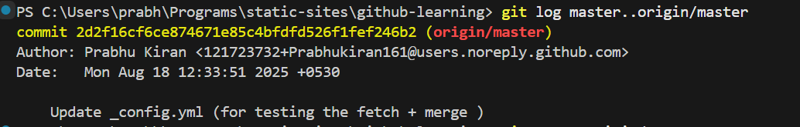

# How To Update Your Local Repo With The Latest Changes

**Usecase :** When your local repo is behind the remote repo , and you want to update it with the latest commits before continuing your work.
**Example :** 
- Remote repo (origin/master) = 8 commits
- Local repo (master) = 5 commits
    - ➡️ Local is behind by 3 commits.

Now if you try to continue work locally without updating, you risk:
- Missing bug fixes/features others pushed.
- Merge conflicts later when you push.

## Two Ways To Update It 
🔹**1. Git Fetch + Merge**
```sh
git fetch origin
```
Downloads new data (commits, branches, tags) from the remote repo (origin) into your local .git database, but does not change your working directory or current branch.
> After running git fetch, you can compare differences:
```sh
git log master..origin/master
```
It shows commits in remote main that you don’t have locally.



```sh
git merge origin/master
```
It merges the commits from remote’s master branch (`origin/master`) into your current local branch.


---
**🔹2. Git Pull**
```sh
git pull origin master
```
It is actually a shortcut for two commands (`fetch + merge`). It fetches updates and then merges them automatically into your current branch. 

**Note:**
- In a real-world scenario, developers often prefer to run  
`git fetch origin` (to see what's new without touching their branch).  

- After inspecting the differences (`git log` or `git diff`), they then decide  
when and how to merge (`git merge` or `git rebase`).  

- This gives more control than a blind `git pull`.

**`Difficulty: ⭐ Beginner`**
